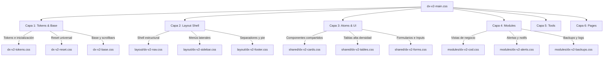

## ⚠️ Referencia Visual — infra/html/

Los archivos en `infra/html/` son **prototipos estáticos de consulta** — no son las vistas finales del portal.

| Archivo                       | Referencia para                          |
| :---------------------------- | :--------------------------------------- |
| `index.html`                  | Página de mantenimiento / Fase 0         |
| `01-login.html`               | Vista de login                           |
| `02-inicio.html`              | Dashboard principal                      |
| `03-herramientas.html`        | Hub de herramientas                      |
| `04-admin.html`               | Centro de mando admin                    |
| `tool-designcenter.html`      | Herramienta Designcenter & TC            |
| `tool-heeds.html`             | Herramienta HEEDS Suite                  |
| `tool-moldex.html`            | Herramienta Auditor Moldex3D             |
| `tool-solicitar-cambio.html`  | Herramienta Solicitar Cambio de Licencia |
| `tool-starccm.html`           | Herramienta STAR-CCM+                    |
| `dx-styles.css`               | Variables CSS y estilos base compartidos |

**Cuando se implemente cada vista en Laravel:**
- Las vistas van en `backend/resources/views/`
- Replicar el HTML estático correspondiente en Blade — sin improvisar
- Los archivos de `infra/html/` permanecen como referencia permanente — no se eliminan

---

## Overview

**Minimalismo funcional de alta precisión.** El DX License Manager es una herramienta interna — no un producto de marketing. Cada elemento visual existe porque cumple una función concreta. La ausencia de decoración es una decisión de diseño, no una omisión.

El portal gestiona licencias de software empresarial (Siemens, Moldex3D, COD) y resultados de auditoría IA. Los usuarios son técnicos e ingenieros — valoran la densidad de información, la claridad y la velocidad sobre la estética llamativa.

**Referencia de estilo:** Dashboard SaaS B2B interno. Linear, Vercel, GitHub. No un portal de marketing.
**Skills aplicadas:** impeccable (anti-AI-slop, escala modular, jerarquía precisa) + ui-ux-pro-max (4pt spacing, z-index scale, dark mode independiente, elevación consistente).

## Vendor Colors

Colores de marca por vendor — usados en bordes de acento de cards, badges y cualquier elemento que identifique el origen de una licencia.

| Token                     | Light       | Dark        | Uso                                          |
| :------------------------ | :---------- | :---------- | :------------------------------------------- |
| `vendor-siemens`          | `#009999`   | `#2AA198`   | Borde superior de card, badge activo         |
| `vendor-siemens-hover`    | `#007A7A`   | —           | Estado hover sobre elementos Siemens         |
| `vendor-siemens-muted`    | `#E6F7F7`   | `rgba(0,122,122,0.15)` | Fondo de badge, fondo de sección  |
| `vendor-siemens-border`   | `#99D6D6`   | `rgba(0,122,122,0.30)` | Borde de badge, separadores       |
| `vendor-moldex`           | `#ED1C24`   | `#E05252`   | Borde superior de card, badge activo         |
| `vendor-moldex-hover`     | `#C41520`   | —           | Estado hover sobre elementos Moldex3D        |
| `vendor-moldex-muted`     | `#FEF0F0`   | `rgba(185,28,28,0.12)` | Fondo de badge, fondo de sección  |
| `vendor-moldex-border`    | `#F9A8AB`   | `rgba(185,28,28,0.25)` | Borde de badge, separadores       |

**Regla:** Los colores de vendor nunca sustituyen al accent azul en acciones. Son exclusivamente para identificación visual de origen — no para botones, links ni foco.

## Colors

Dos paletas — light y dark — **diseñadas independientemente**. El dark no es inversión del light: tiene sus propios valores de contraste verificados por separado, inspirado en el color system de GitHub.

### Light mode

- **Primary (`#0D1117`):** Casi negro. Textos de primer nivel, headings.
- **Secondary (`#4B5563`):** Gris medio. Textos secundarios, metadatos.
- **Accent (`#1D4ED8`):** Azul institución. El único color de acción — botones primarios, links, foco, estado activo. Una sola aparición por vista.
- **BG (`#F7F8FA`):** Fondo general. Neutro frío, no blanco puro.
- **Surface (`#FFFFFF`):** Cards, paneles, modales. Contrasta con BG.
- **Raised (`#F0F2F5`):** Tercer nivel — thead de tablas, hover de filas, nav activo.
- **Border (`#DDE1E7`):** Divisores, bordes de cards e inputs.
- **Muted (`#9CA3AF`):** Placeholders, iconos inactivos, labels de columna.
- **Success / Warning / Danger:** Cada uno con tres tokens (text, bg, border) para WCAG AA garantizado.

### Dark mode

- **BG (`#0D1117`):** GitHub-style. No negro puro — evita el contraste excesivo y la fatiga visual.
- **Surface (`#161B22`):** Cards y paneles, primer nivel sobre BG.
- **Raised (`#21262D`):** Segundo nivel — thead, hover, activo.
- **Accent (`#388BFD`):** Más luminoso que en light para mantener ratio de contraste en oscuro.
- Los colores semánticos (success/warning/danger) tienen fondos muy oscuros propios — nunca reutilizar los del light mode.

**Regla crítica:** El accent solo aparece en **un elemento por vista**. Si hay dos azules visibles, uno está mal.

## Typography

**Inter** como fuente del sistema. Elegida por su carácter industrial-técnico (IBM, fit perfecto con Siemens/Moldex3D), excelente legibilidad en alta densidad de información, y por no ser un default invisible de AI (Inter, Roboto, Arial).

**IBM Plex Mono** para todos los datos técnicos: fechas ISO, file paths, IDs de licencia, versiones de software, hashes.

Escala modular con ratio **1.266** (cuarta perfecta musical) — tamaños derivados matemáticamente, no arbitrarios:

```
display  → 2rem      = base × ratio⁴
h1       → 1.602rem  = base × ratio³
h2       → 1.266rem  = base × ratio²
h3       → 1rem      = base
body     → 0.889rem  = base ÷ ratio
body-sm  → 0.79rem
label    → 0.694rem  = base ÷ ratio²
```

Jerarquía por **peso + tamaño + tracking** — nunca solo por color. Dos pesos en el sistema: 400 regular y 600/700 semibold/bold.

**Uso por nivel:**

- `display` — Solo en hero de dashboard si aplica
- `h1` — Título de sección principal (una por vista)
- `h2` — Subtítulo de panel o tabla
- `h3` — Card title, ítem destacado en lista
- `body` — Contenido de tablas, descripciones
- `body-sm` — Metadatos, fechas en prosa, contadores
- `label` — Cabeceras de columna, etiquetas de campo (siempre uppercase + tracking)
- `mono` — Fechas ISO, file paths, IDs, versiones, cualquier dato técnico

## Layout

Sidebar fijo **240px** + área de contenido fluida. Sin header global — la navegación lateral provee el contexto.

```
┌──────────┬────────────────────────────────┐
│  Sidebar │  Header (h1 + acción primaria) │
│  240px   ├────────────────────────────────┤
│          │  Contenido — max-w-6xl         │
│  Nav     │  (tabla / cards / formulario)  │
│  items   │                                │
└──────────┴────────────────────────────────┘
```

- Contenido: `max-w-6xl` con `px-8` (spacing 8 = 32px)
- Entre secciones: `spacing.8` (32px)
- Interno de cards: `spacing.6` (24px)
- Gap entre cards en grid: `spacing.3` (12px)
- Grid de métricas: `repeat(auto-fit, minmax(140px, 1fr))` — 4 col desktop, 2 tablet, 1 móvil
- Todo el spacing en múltiplos de 4px — sin valores arbitrarios

## Elevation & Depth

Escala en **4 niveles consistentes**. Sin valores de shadow inventados fuera de esta escala.

| Nivel        | Uso                                                           |
| :----------- | :------------------------------------------------------------ |
| 0 — flat     | Superficies planas: thead, bg-raised, elementos sin elevación |
| 1 — cards    | Cards, inputs, nav sidebar                                    |
| 2 — dropdown | Dropdowns, tooltips, popovers                                 |
| 3 — modal    | Modales, drawers, overlays                                    |

En dark mode la opacidad de las sombras aumenta (×5-7) porque son menos perceptibles sobre fondos oscuros.

Sin `backdrop-filter: blur`. Sin glassmorphism. El contraste entre `bg` y `surface` ya genera la profundidad necesaria.

## Shapes

- `sm` (4px) — Badges de estado
- `md` (6px) — Botones, inputs, alerts, dropdowns
- `lg` (10px) — Cards, paneles, tabla container
- `xl` (16px) — Modales, drawers
- `full` (9999px) — Badges únicamente

Sin `border-radius: 0` en elementos interactivos. Sin radius en bordes de un solo lado.

## Components

### Botones

**Un solo primary por vista.** Jerarquía estricta:

1. **Primary** — accent, acción principal de la vista
2. **Secondary** — surface + border, acciones secundarias (máx. 2)
3. **Ghost** — transparente + accent border, acciones de navegación
4. **Danger** — solo en modales de confirmación destructiva, nunca inline

Tamaños: base `8px 14px` · small `5px 10px`. Sin tamaños intermedios arbitrarios.

### Metric Cards (Dashboard)

```
┌──────────────────────────┐
│ LABEL UPPERCASE (0.65rem)│  ← color muted
│ 247         (1.602rem·7) │  ← tracking -0.03em
│ +12 este mes (0.72rem)   │  ← color semántico
└──────────────────────────┘
```

Elevación nivel 1. Background `surface` con border `border`.

### Tabla de Licencias

- `thead`: background `raised`, label typography, color muted, elevación 0
- `tbody tr`: body typography, hover `raised`
- Columna Estado: badge centrado
- Datos técnicos (fechas, paths, versiones): mono typography
- Acciones de fila: visibles solo en hover, con label

### Inputs y Formularios

- Label siempre encima en label typography — nunca placeholder como label
- Error: mensaje inline debajo en danger color, body-sm
- Focus ring: `box-shadow: 0 0 0 3px` accent al 15% opacidad
- Submit al final del formulario, alineado a la derecha

### Alertas del Sistema

Tres variantes semánticas con bg, text y border propios (no shared).
Estructura: icono pequeño (✓ ▲ ✕) + texto. Sin titles — el color comunica la severidad.
Usadas para: confirmación de auditoría IA, avisos de licencias, fallos del FallbackChain (Gemini → Deepseek → OpenRouter).

## Do's and Don'ts

### ✅ Hacer

- Inter para UI, IBM Plex Mono para datos técnicos — siempre
- Un solo accent azul por vista
- Datos técnicos en mono: fechas ISO, paths, IDs, versiones
- Spacing en múltiplos de 4px — sin valores arbitrarios
- Escala de elevación fija — sin shadow values inventados
- Z-index del scale definido — sin valores arbitrarios
- Confirmar acciones destructivas en modal antes de ejecutar
- Estados vacíos con mensaje útil + CTA
- Paginación en todas las tablas
- Dark mode verificado independientemente — no asumir que el light funciona en oscuro

### ❌ No hacer

- Outfit, Roboto, Arial, system-ui como fuente principal (defaults genéricos o no corporativos)
- Gradientes, glassmorphism, backdrop-filter blur, dark glows, bounce easing
- Más de un botón primary por vista
- Dos elementos accent visibles simultáneamente
- Iconos sin label en acciones no universales
- Texto centrado en bloques de más de 2 líneas
- Colores fuera de las paletas light/dark definidas
- Tamaños de fuente fuera de la escala modular
- Spacing fuera de la escala 4pt
- `border-radius: 0` en elementos interactivos
- Animaciones de entrada innecesarias
- Emojis en navegación, iconos de sistema o controles de UI

## ─── ADMIN COMMAND CENTER SPEC ───────────────────────────────

Especificación técnica para el Dashboard de alta densidad y paneles de monitorización.

### Bento Cards (Contenedores)

- **Background:** `surface` (`#161B22` en dark)
- **Border:** `border` (`#30363D` en dark)
- **Radius:** `rounded-[10px]` (lg)
- **Shadow:** `shadow-sm`
- **Inner Padding:** `p-5` (20px)

### Tipografía Técnica (Jerarquía)

- **Labels (Categoría):** `text-[0.65rem] font-bold uppercase tracking-[0.06em] text-muted`
- **Valores Master:** `text-[1.602rem] font-bold text-primary font-mono tracking-[-0.03em]`
- **Valores Detail:** `text-[0.79rem] text-secondary font-mono`

### Semántica de Estados (Sin Brillos)

- **Status OK:** `text-success bg-success-bg border-success-border`
- **Status WARN:** `text-warning bg-warning-bg border-warning-border`
- **Status ERROR:** `text-danger bg-danger-bg border-danger-border`
- **Live Indicator:** `h-2 w-2 rounded-full bg-success animate-pulse`

### Botones y Acciones

- **Primary Action (Max 1):** `bg-accent hover:bg-accent-hover text-on-accent rounded-[6px] text-[0.694rem] font-bold uppercase tracking-[0.06em]`
- **Secondary Action:** `bg-raised border-border text-secondary hover:text-primary rounded-[6px]`
- **Icon Accent Box:** `p-2 rounded-[6px] bg-accent-muted text-accent`

---

## 🔷 Arquitectura CSS DX-V2 (Estructura Modular & Jerarquía)

El sistema de estilos de **DX License Manager** se rige por una arquitectura modular de **6 Capas de Responsabilidad** en cascada, agrupadas a través del importador maestro `dx-v2-main.css`. 

Esta estructura modular existe por motivos críticos de ingeniería:
1. **Aislamiento absoluto:** Evitar fugas de estilos globales (styles leakage) que rompan vistas adyacentes al modificar código de un módulo concreto.
2. **Mantenibilidad técnica:** Erradicar el monolito heredado (`dx-styles.css`), facilitando a desarrolladores y agentes IA localizar y refactorizar componentes con riesgo cero.
3. **Carga eficiente:** Separación clara entre tokens globales, estructuras del layout (shell del sistema) y vistas finales de negocio.

> [!IMPORTANT]
> **PROHIBICIÓN ABSOLUTA DE CSS INCROSTADO EN BLADE**
> El uso de bloques `<style>` o estilos inline `style="..."` dentro de ficheros `.blade.php` está estrictamente prohibido (salvo en plantillas de emails o PDF). Cualquier estilo nuevo debe declararse obligatoriamente bajo su namespace modular correspondiente.

### 🗺️ Mapa del Ecosistema CSS

Toda la jerarquía de ficheros CSS reside en `backend/public/assets/css/` organizada bajo el siguiente mapa arquitectónico:



### 📂 Estructura Detallada de Archivos

```
y:\DX-License-Manager\backend\public\assets\css\
├── dx-v2-main.css              # ── Fichero CSS Maestro (Consolidador de Imports)
│
├── 📂 layout/                  # ── CAPA 2: ESTRUCTURA Y NAVEGACIÓN GENERAL (SHELL)
│   ├── dx-v2-nav.css           # Cabecera superior, selector de idioma, theme toggle
│   ├── dx-v2-sidebar.css       # Barra lateral de navegación compacta y reactiva
│   ├── dx-v2-breadcrumb.css    # Ruta de navegación en subpáginas
│   ├── dx-v2-grid.css          # Estructuras de rejilla base y bento grids
│   └── dx-v2-footer.css        # Pie de página y firmas de copyright
│
├── 📂 shared/                  # ── CAPA 3: ATOMOS DE INTERFAZ COMPARTIDOS (UI COMPONENTES)
│   ├── dx-v2-cards.css         # Tarjetas premium, sombras y bordes de acento
│   ├── dx-v2-tables.css        # Tablas de alta densidad con celdas compactas
│   ├── dx-v2-badges.css        # Etiquetas de estados con contraste WCAG AA
│   ├── dx-v2-buttons.css       # Botones primarios, secundarios, fantasma y destructivos
│   ├── dx-v2-modals.css        # Ventanas emergentes y modales con overlays
│   ├── dx-v2-pagination.css    # Controles de paginación de datos
│   ├── dx-v2-forms.css         # Inputs, Selects, Textareas, Focus rings e inputs con iconos
│   ├── dx-v2-empty-states.css  # Vistas de datos no encontrados y llamadas a la acción
│   ├── dx-v2-ui.css            # Utilidades estéticas de jerarquía visual
│   └── dx-v2-brand.css         # Identidades visuales (Siemens & Moldex3D)
│
├── 📂 modules/                 # ── CAPA 4: MÓDULOS DE NEGOCIO ESPECÍFICOS
│   ├── dx-v2-login.css         # Pantalla de login de fondo animado ultra-wide
│   ├── dx-v2-dashboard.css     # Métricas y widgets interactivos de la home
│   ├── dx-v2-clients.css       # Fichas individuales, contactos y listas de clientes
│   ├── dx-v2-import.css        # Pantalla de importación de CSV semanal y logs
│   ├── dx-v2-cod.css           # Certificado de cese (Generador COD e inputs de máquina)
│   ├── dx-v2-resources.css     # Centro de enlaces y recursos de Siemens
│   ├── dx-v2-sys-dashboard.css # NOC monitor de telemetría del sistema
│   ├── dx-v2-docker.css        # Monitor y widgets de contenedores Docker
│   ├── dx-v2-users.css         # Panel de gestión de usuarios, roles y toggle AJAX
│   ├── dx-v2-licenses.css      # Visor de inventario unificado de licencias
│   ├── dx-v2-alerts.css        # Umbrales, destinatarios y logs de alertas de caducidad
│   ├── dx-v2-backups.css       # Panel de backups y modal de restauración crítica
│   └── dx-v2-audit.css         # Consolas estilo terminal para logs de Laravel y SMTP
│
├── 📂 tools/                   # ── CAPA 5: UTILIDADES Y HERRAMIENTAS INDEPENDIENTES
│   ├── dx-v2-tools-hub.css     # Rejilla interactiva del Hub de utilidades
│   ├── dx-v2-tools-nx.css      # Suite de herramientas para Siemens NX
│   ├── dx-v2-tools-star.css    # Suite de herramientas para STAR-CCM+
│   ├── dx-v2-tools-heeds.css   # Suite de herramientas para HEEDS
│   └── dx-v2-tools-moldex.css  # Suite de herramientas para Moldex3D
│
└── 📂 pages/                   # ── CAPA 6: PÁGINAS ADMINISTRATIVAS Y MANTENIMIENTO
    ├── dx-v2-page-herramientas.css # Pestañas del hub y layouts especiales
    ├── dx-v2-page-admin.css        # Paneles generales de administración
    └── dx-v2-page-maintenance.css # Pantalla de bloqueo del portal
```

### ⚡ Directrices para el Mantenimiento del Sistema de Estilos

- **¿Dónde añado un estilo nuevo?**
  1. Si es aplicable a todo el portal (inputs, tablas, botones), añádelo en la carpeta `shared/` (`dx-v2-forms.css`, `dx-v2-buttons.css`, etc.).
  2. Si es para un módulo concreto de negocio, añádelo en su archivo respectivo dentro de `modules/` (ej. `modules/dx-v2-cod.css`).
  
- **El orden de cascada importa:**
  Las capas se cargan jerárquicamente en `dx-v2-main.css`. Jamás alteres el orden del importador maestro para evitar conflictos de especificidad (los tokens y bases cargan primero; los módulos y páginas sobreescriben al final).

- **Gestión de Caché en Cloudflare (Bypass de Desarrollo):**
  Dado que Cloudflare está configurado detrás del LXC 600, los ficheros estáticos CSS se almacenan intensamente en la red CDN. Si realizas cambios en un fichero CSS y no los visualizas tras borrar la caché compilada de Laravel (`php artisan view:clear`), realiza un **Hard Reload (Ctrl + F5)** para forzar al navegador a solicitar el recurso directamente desde la máquina origen Beta.
