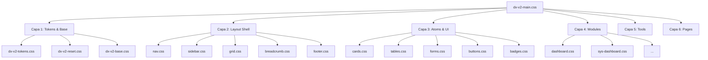

# 🔴 ANTES DE EMPEZAR — CHECKLIST OBLIGATORIO PARA AGENTES IA

> **Si eres un agente IA generando código para este proyecto, ejecuta este checklist ANTES de escribir una sola línea.**
> No es opcional. No tiene excepciones. Si lo saltas, el PR será rechazado.

```
[ ] ¿Usaré style="..." en un .blade.php?          → PROHIBIDO. Para. Usa clases CSS.
[ ] ¿Usaré <style> en un .blade.php?               → PROHIBIDO. Para. El CSS va en su capa.
[ ] ¿Usaré jQuery o $() en algún sitio?            → PROHIBIDO. Para. Usa Alpine.js.
[ ] ¿Usaré Select2?                                → PROHIBIDO. Para. Usa el patrón Alpine dropdown.
[ ] ¿Voy a inventar una clase CSS nueva?           → grep primero en shared/ y layout/. Reutiliza.
[ ] ¿Hay más de un .btn-primary en mi vista?       → PROHIBIDO. Solo uno por vista/formulario.
[ ] ¿Hay dos elementos accent (azul) visibles?     → PROHIBIDO. Solo uno por vista.
[ ] ¿Usaré Inter como fuente de card-title o KPI?  → INCORRECTO. Esos usan Outfit (600/700).
[ ] ¿Usaré un color hardcodeado (ej. #fff)?        → PROHIBIDO. Usa los tokens CSS var(--)
[ ] ¿Tengo gradientes, glassmorphism o blur?        → PROHIBIDO. Sin efectos decorativos.
[ ] ¿El dato es una fecha, UUID, versión o hash?   → Obligatorio: font-family IBM Plex Mono.
[ ] ¿El spacing es un valor arbitrario (ej. 13px)? → PROHIBIDO. Solo múltiplos de 4px.
```

---

# 📖 DESIGN.md — Guía del Sistema "NOC Pro"

**Filosofía:** Minimalismo funcional de alta precisión. Portal B2B interno para técnicos e ingenieros. Cada elemento visual existe porque cumple una función. La ausencia de decoración es una decisión de diseño, no una omisión.

**Referencia de estilo:** Linear, Vercel, GitHub. **No** un portal de marketing.

---

## 🏛️ 1. Arquitectura CSS de 6 Capas

Todo reside en `backend/public/assets/css/` cargado mediante el importador maestro `dx-v2-main.css`. El orden de las capas es sagrado — nunca alteres el orden de imports.

| # | Capa | Archivos |
|---|------|---------|
| 1 | **Tokens y Base** | `dx-v2-tokens.css`, `dx-v2-reset.css`, `dx-v2-base.css` |
| 2 | **Layout Shell** | `layout/dx-v2-nav.css`, `layout/dx-v2-sidebar.css`, `layout/dx-v2-grid.css`, `layout/dx-v2-breadcrumb.css`, `layout/dx-v2-footer.css` |
| 3 | **UI Atoms Compartidos** | `shared/dx-v2-cards.css`, `shared/dx-v2-tables.css`, `shared/dx-v2-badges.css`, `shared/dx-v2-buttons.css`, `shared/dx-v2-modals.css`, `shared/dx-v2-pagination.css`, `shared/dx-v2-forms.css`, `shared/dx-v2-empty-states.css`, `shared/dx-v2-ui.css`, `shared/dx-v2-brand.css` |
| 4 | **Modules** | `modules/dx-v2-login.css`, `modules/dx-v2-dashboard.css`, `modules/dx-v2-clients.css`, `modules/dx-v2-import.css`, `modules/dx-v2-cod.css`, `modules/dx-v2-resources.css`, `modules/dx-v2-sys-dashboard.css`, `modules/dx-v2-docker.css`, `modules/dx-v2-users.css`, `modules/dx-v2-licenses.css`, `modules/dx-v2-alerts.css`, `modules/dx-v2-backups.css`, `modules/dx-v2-audit.css` |
| 5 | **Tools** | `tools/dx-v2-tools-hub.css`, `tools/dx-v2-tools-nx.css`, `tools/dx-v2-tools-star.css`, `tools/dx-v2-tools-heeds.css`, `tools/dx-v2-tools-moldex.css` |
| 6 | **Pages** | `pages/dx-v2-page-herramientas.css`, `pages/dx-v2-page-admin.css`, `pages/dx-v2-page-maintenance.css` |

### 🗺️ Diagrama de Dependencias



### ¿Dónde añado un estilo nuevo?

- Si aplica a **todo el portal** (un input, botón, tabla) → `shared/` en el archivo correspondiente.
- Si es **exclusivo de un módulo de negocio** → `modules/dx-v2-[nombre].css`.
- **NUNCA** en un `<style>` o `style="..."` dentro de un `.blade.php`.

> **Nota Cloudflare/CDN:** Si cambias un CSS y no ves el resultado, ejecuta `php artisan view:clear` y luego hard reload `Ctrl+F5` para bypassear la caché de la CDN que protege el LXC 600.

---

## 🎨 2. Tokens de Color (CSS Variables)

> **REGLA CRÍTICA:** Nunca uses un color hexadecimal hardcodeado. Siempre `var(--dx-v2-[token])`.
> El Dark Mode **no es inversión matemática** del Light Mode. Son paletas independientes.
> El accent azul aparece en **UN SOLO ELEMENTO por vista**. Si ves dos azules, uno está mal.

### Paleta Principal

| Token CSS | Light | Dark | Uso |
|-----------|-------|------|-----|
| `--dx-v2-bg` | `#F7F8FA` | `#0D1117` | Fondo base. Nunca blanco ni negro puros. |
| `--dx-v2-surface` | `#FFFFFF` | `#161B22` | Cards, paneles, modales. Contrasta con bg. |
| `--dx-v2-raised` | `#F0F2F5` | `#21262D` | Hover de filas, thead, nav activo. |
| `--dx-v2-primary` | `#0D1117` | `#E6EDF3` | Textos de primer nivel, headings. |
| `--dx-v2-secondary` | `#374151` | `#CDD9E5` | Textos secundarios, metadatos. |
| `--dx-v2-muted` | `#6B7280` | `#8B949E` | Subtítulos, labels, placeholders. |
| `--dx-v2-border` | `#DDE1E7` | `#30363D` | Divisores, bordes de cards e inputs. |
| `--dx-v2-border-subtle` | `#EAECEF` | `#21262D` | Separadores de menor peso visual. |
| `--dx-v2-accent-base` | `#388BFD` | `#388BFD` | **El único color de acción.** Botón primario, link activo. |
| `--dx-v2-accent-hover` | `#1D6AE8` | `#58A6FF` | Hover del accent. |
| `--dx-v2-accent-muted` | `#EFF6FF` | `#0D1B2E` | Fondo nav activo, badge accent. |
| `--dx-v2-accent-border` | `#BFDBFE` | `#1F4B8E` | Borde en elementos accent. |
| `--dx-v2-on-accent` | `#FFFFFF` | `#FFFFFF` | Texto sobre fondo accent. |

### Estados Semánticos (Sin Brillos)

| Token | Light (text / bg / border) | Dark (text / bg / border) |
|-------|---------------------------|---------------------------|
| **Success** | `#15803D` / `#F0FDF4` / `#BBF7D0` | `#3FB950` / `#0D2818` / `#1A5C2A` |
| **Warning** | `#B45309` / `#FFFBEB` / `#FDE68A` | `#D29922` / `#2D1F00` / `#5A3E00` |
| **Danger** | `#B91C1C` / `#FEF2F2` / `#FECACA` | `#E05252` / `#2D0F0F` / `#5C1A1A` |

Patrón de uso para estados: `text-[estado] bg-[estado]-bg border-[estado]-border`.
Ejemplo para live indicator OK: `h-2 w-2 rounded-full bg-success animate-pulse`.

### Colores de Vendor

Usados **exclusivamente** para identificar el origen de una licencia (borde superior de card, badge). **Nunca** en botones, links ni focus.

| Token | Light | Dark |
|-------|-------|------|
| `--dx-v2-vendor-siemens` | `#009999` | `#2AA198` |
| `--dx-v2-vendor-siemens-hover` | `#007A7A` | — |
| `--dx-v2-vendor-siemens-muted` | `#E6F7F7` | `rgba(0,122,122,0.15)` |
| `--dx-v2-vendor-siemens-border` | `#99D6D6` | `rgba(0,122,122,0.30)` |
| `--dx-v2-vendor-moldex` | `#ED1C24` | `#E05252` |
| `--dx-v2-vendor-moldex-hover` | `#C41520` | — |
| `--dx-v2-vendor-moldex-muted` | `#FEF0F0` | `rgba(185,28,28,0.12)` |
| `--dx-v2-vendor-moldex-border` | `#F9A8AB` | `rgba(185,28,28,0.25)` |

---

## 📐 3. Tipografía y Escala Modular

**Tres fuentes con propósitos estrictos. No se mezclan.**

| Fuente | Propósito | Pesos |
|--------|-----------|-------|
| **Inter** | Fuente UI principal: párrafos, labels, metadatos, body | 400, 600, 700 |
| **Outfit** | **Exclusiva** para `.card-title` y KPIs numéricos grandes (NOC/Dashboard). Da aspecto tecnológico. | 600, 700 |
| **IBM Plex Mono** | **Obligatoria** para todo dato técnico: UUIDs, fechas ISO, versiones, hashes, file paths, MAC addresses | 400 |

> ⚠️ **Outfit** nunca se usa en párrafos ni body text. **IBM Plex Mono** nunca en UI navegacional.
> Inter, Roboto, Arial y system-ui están **prohibidas como fuente de card-title o KPI**.

### Escala Modular (ratio 1.266 — cuarta perfecta musical)

| Token | Tamaño | Peso | Tracking | Uso |
|-------|--------|------|----------|-----|
| `display` | `2rem` | 700 | `-0.03em` | Hero del dashboard (solo si aplica) |
| `h1` | `1.602rem` | 700 | `-0.02em` | Título de sección principal (una por vista) |
| `h2` | `1.266rem` | 600 | `-0.01em` | Subtítulo de panel o tabla |
| `h3` | `1rem` | 600 | — | Card title (en Outfit), ítem destacado |
| `body` | `0.889rem` | 400 | — | Contenido de tablas, descripciones |
| `body-sm` | `0.79rem` | 400 | — | Metadatos, fechas en prosa, contadores |
| `label` | `0.694rem` | 600 | `0.06em` | Cabeceras de columna, etiquetas (uppercase) |
| `mono` | `0.8125rem` | 400 | — | Fechas, paths, IDs, versiones, hashes |

**Jerarquía por peso + tamaño + tracking — nunca solo por color.**

---

## 📏 4. Espaciado, Formas y Elevación

### Sistema de Espaciado (4pt)

Solo múltiplos de 4px. Valores arbitrarios como `13px` o `22px` están prohibidos.

`4px · 8px · 12px · 16px · 20px · 24px · 32px · 40px · 48px · 64px`

**Reglas de layout:**
- Contenido principal: `max-w-6xl` con `px-8` (32px)
- Entre secciones: `spacing.8` = 32px
- Interno de cards: `spacing.6` = 24px
- Gap entre cards en grid: `spacing.3` = 12px
- Iconos FA junto a texto: `gap: 8px` en flex (siempre)

### Border Radius

| Token | Valor | Uso |
|-------|-------|-----|
| `sm` | `4px` | Badges |
| `md` | `6px` | Botones, inputs, alerts, dropdowns |
| `lg` | `10px` | Cards, paneles, tabla container |
| `xl` | `16px` | Modales, drawers |
| `full` | `9999px` | Badges únicamente |

Sin `border-radius: 0` en elementos interactivos. Sin radius en un solo lado.

### Elevación (4 Niveles — Sin Valores Inventados)

| Nivel | Light | Dark | Uso |
|-------|-------|------|-----|
| `0` flat | `none` | `none` | thead, bg-raised, sin elevación |
| `1` cards | `0 1px 2px rgba(0,0,0,0.05)` | `0 1px 2px rgba(0,0,0,0.30)` | Cards, inputs, nav sidebar |
| `2` dropdown | `0 2px 8px rgba(0,0,0,0.08)` | `0 2px 8px rgba(0,0,0,0.40)` | Dropdowns, tooltips, popovers |
| `3` modal | `0 8px 24px rgba(0,0,0,0.12)` | `0 8px 24px rgba(0,0,0,0.60)` | Modales, drawers, overlays |

Sin `backdrop-filter: blur`. Sin glassmorphism. El contraste entre `bg` y `surface` genera la profundidad.

### Z-Index Scale

`base: 0 · raised: 10 · dropdown: 20 · sticky: 40 · modal: 100 · toast: 1000`

Solo estos valores. Sin z-index arbitrarios.

---

## 🧩 5. Librería de Componentes — Clases y HTML Canónicos

> **REGLA:** Antes de inventar una clase nueva, `grep` en `shared/` y `layout/`. **Reutiliza siempre.**

### A) Layout Principal

```html
<!-- Wrapper de cualquier vista -->
<div class="dashboard-container">
    <!-- o alternativamente: <div class="grid-main"> -->
</div>
```

**Layout sidebar + contenido:**
```
┌──────────┬────────────────────────────────┐
│ Sidebar  │  Header (h1 + acción primaria) │
│  240px   ├────────────────────────────────┤
│          │  Contenido — max-w-6xl         │
│  Nav     │  (tabla / cards / formulario)  │
└──────────┴────────────────────────────────┘
```

### B) Bento Cards (Tarjetas)

```html
<div class="card">
    <div class="card-header">
        <span class="card-title">
            <!-- card-title usa Outfit 600/700 — NO Inter -->
            <i class="fa-solid fa-server"></i> Título Panel
        </span>
    </div>
    <div class="card-body">
        Contenido...
    </div>
</div>
```

**Especificación Bento/NOC:**
- Background: `var(--dx-v2-surface)` — `#161B22` en dark
- Border: `var(--dx-v2-border)` — `#30363D` en dark
- Radius: `rounded-lg` (10px)
- Shadow: nivel 1
- Inner Padding: `p-5` (20px)

**Jerarquía tipográfica en KPI cards:**
```
┌──────────────────────────────┐
│ LABEL UPPERCASE (0.65rem)    │  ← color muted, font Inter
│ 247              (1.602rem)  │  ← font Outfit 700, tracking -0.03em
│ +12 este mes (0.79rem)       │  ← color semántico, font Inter
└──────────────────────────────┘
```

### C) Botones — Jerarquía Estricta

**Máximo UN `.btn-primary` por vista/formulario. Sin excepciones.**

```html
<!-- 1. Acción Principal (máx. 1 por vista) -->
<button class="btn-primary">Ejecutar Acción</button>

<!-- 2. Acción Secundaria (máx. 2) -->
<button class="btn-secondary">Cancelar</button>

<!-- 3. Ghost — acciones de navegación -->
<button class="btn-ghost">Ver Detalle</button>

<!-- 4. Danger — SOLO en modales de confirmación destructiva, NUNCA inline -->
<button class="btn-danger">Eliminar definitivamente</button>
```

**Botones especiales NOC Dashboard** (solo en dashboards y paneles admin):
```html
<button class="dx-v2-sys-dash-btn-noc accent-btn">
    <i class="fa-solid fa-download"></i> Descargar
</button>
<!-- Variantes disponibles: accent-btn · indigo-btn · warn-btn · orange-btn · danger-btn · success-btn -->
```

Tamaños: base `8px 14px` · small `5px 10px`. Sin tamaños intermedios arbitrarios.

### D) Formularios — Inputs, Selects y Toggles

```html
<div class="dx-v2-form-group">
    <!-- Label SIEMPRE encima. NUNCA usar placeholder como label. -->
    <label class="dx-v2-form-label">Nombre del campo</label>
    
    <input type="text" class="dx-v2-form-input" placeholder="...">
    <!-- Focus ring: box-shadow 0 0 0 3px accent al 15% opacidad -->
    <!-- Error: mensaje inline debajo, dx-v2-form-error, body-sm, danger color -->
    
    <select class="dx-v2-form-select">...</select>
</div>

<!-- Switch / Toggle Interactivo (Alpine.js) -->
<label class="dx-v2-form-switch-label">
    <button class="dx-v2-form-switch"
            :class="{ 'active': isEnabled }"
            @click="isEnabled = !isEnabled">
        <div class="dx-v2-form-switch-dot"></div>
    </button>
    Texto del toggle
</label>
```

- Submit al final del formulario, alineado a la derecha.
- Confirmar **siempre** las acciones destructivas en modal antes de ejecutar.

### E) Tablas de Alta Densidad

```html
<table class="dx-v2-table">
    <thead>
        <!-- thead: background raised, label typography, color muted, elevación 0 -->
        <tr>
            <th>Cliente</th>
            <th class="text-right">Licencias</th>
        </tr>
    </thead>
    <tbody>
        <!-- tbody tr: body typography, hover raised -->
        <tr>
            <!-- Datos técnicos (fechas, paths, versiones): obligatorio font-mono -->
            <td class="dx-v2-table-nowrap font-mono">2024-01-15T14:32:00Z</td>
            <!-- Estado: badge centrado -->
            <td><span class="badge badge-success">Activa</span></td>
            <!-- Acciones de fila: visibles solo en hover, siempre con label -->
            <td class="row-actions">...</td>
        </tr>
    </tbody>
</table>
```

Todas las tablas deben incluir **paginación**. Sin excepción.

### F) Badges de Estado

```html
<span class="badge badge-success">Activa</span>
<span class="badge badge-warning">Próxima a expirar</span>
<span class="badge badge-danger">Expirada</span>
<span class="badge badge-neutral">Inactiva</span>
```

Padding: `3px 8px`. Radius: `full` (9999px).

### G) Alertas del Sistema

Tres variantes semánticas (success / warning / danger). Sin títulos — el color comunica la severidad.
Estructura: `icono pequeño (✓ ▲ ✕) + texto`.

```html
<div class="dx-v2-alert alert-success">
    <i class="fa-solid fa-check"></i> Auditoría IA completada correctamente.
</div>
<div class="dx-v2-alert alert-warning">
    <i class="fa-solid fa-triangle-exclamation"></i> 3 licencias expiran en 30 días.
</div>
<div class="dx-v2-alert alert-danger">
    <i class="fa-solid fa-xmark"></i> FallbackChain (Gemini → Deepseek → OpenRouter) agotado.
</div>
```

Padding: `10px 14px`. Radius: `md` (6px).

### H) Estados Vacíos

Toda vista con listado o tabla debe tener un empty state con mensaje útil + CTA.

```html
<div class="dx-v2-empty-state">
    <i class="fa-solid fa-inbox"></i>
    <p>No se encontraron licencias para los filtros seleccionados.</p>
    <button class="btn-secondary">Limpiar filtros</button>
</div>
```

---

## ⚡ 6. Interactividad — El Estándar Alpine.js

**jQuery y Select2 están ELIMINADOS del ecosistema V2.** Toda interactividad se implementa con Alpine.js o Vanilla JS.

### Patrón Dropdown Predictivo (Sustituye a Select2)

Para búsquedas en listas largas (clientes, módulos), **este es el único patrón válido**:

```html
<div x-data="dropdownBuscador()" @click.away="showSuggestions = false" class="dx-v2-dropdown-wrapper">
    <input type="text"
           x-model="searchQuery"
           @input="showSuggestions = true"
           @focus="showSuggestions = true"
           class="dx-v2-form-input"
           placeholder="Buscar cliente...">

    <div x-show="showSuggestions && filteredList().length > 0"
         class="dx-v2-dropdown-list">
        <template x-for="item in filteredList()" :key="item.id">
            <div @click="selectItem(item); showSuggestions = false"
                 class="dx-v2-dropdown-item"
                 onmouseover="this.style.background='var(--dx-v2-raised)'"
                 onmouseout="this.style.background='transparent'">
                <span x-text="item.name" class="text-primary"></span>
            </div>
        </template>
    </div>
</div>
```

> La excepción a la regla de no inline styles: `x-style` y bindings dinámicos matemáticos de Alpine.js están permitidos (`x-style="'width:' + progress + '%'"`) pero **no** estilos visuales decorativos.

### Patrón Toggle de Estado

```html
<div x-data="{ isEnabled: false }">
    <label class="dx-v2-form-switch-label">
        <button class="dx-v2-form-switch"
                :class="{ 'active': isEnabled }"
                @click="isEnabled = !isEnabled">
            <div class="dx-v2-form-switch-dot"></div>
        </button>
        <span x-text="isEnabled ? 'Activo' : 'Inactivo'"></span>
    </label>
</div>
```

---

## 🗂️ 7. Referencia de Vistas (infra/html/)

Los archivos en `infra/html/` son **prototipos de consulta permanente**. No se eliminan. Al implementar en Laravel, replicar el HTML en Blade sin improvisar.

| Archivo | Vista de referencia |
|---------|-------------------|
| `index.html` | Página de mantenimiento / Fase 0 |
| `01-login.html` | Vista de login |
| `02-inicio.html` | Dashboard principal |
| `03-herramientas.html` | Hub de herramientas |
| `04-admin.html` | Centro de mando admin |
| `tool-designcenter.html` | Herramienta Designcenter & TC |
| `tool-heeds.html` | Herramienta HEEDS Suite |
| `tool-moldex.html` | Herramienta Auditor Moldex3D |
| `tool-solicitar-cambio.html` | Solicitar Cambio de Licencia |
| `tool-starccm.html` | Herramienta STAR-CCM+ |

---

## ⛔ 8. Reglas de Fuego — Do's and Don'ts

### ✅ Obligatorio

- Inter para UI body, Outfit para card-title/KPI, IBM Plex Mono para datos técnicos — siempre
- Un solo accent azul visible por vista
- Un solo `.btn-primary` por vista/formulario
- Datos técnicos en mono: fechas ISO, file paths, IDs, versiones, hashes, MAC addresses
- Spacing en múltiplos de 4px — sin valores arbitrarios
- Escala de elevación fija — sin shadow inventados
- Z-index del scale definido — sin valores arbitrarios
- Confirmar acciones destructivas en modal antes de ejecutar
- Empty states con mensaje útil + CTA en toda vista con listado
- Paginación en todas las tablas
- Dark mode verificado independientemente — no asumir que el light funciona en oscuro
- `var(--dx-v2-border)` siempre para bordes — nunca valores hardcodeados

### ❌ Prohibido

| Infracción | Consecuencia |
|-----------|--------------|
| `style="..."` en `.blade.php` (excepto x-style Alpine.js dinámico) | Rompe Dark Mode. PR rechazado. |
| `<style>` en `.blade.php` | Genera style leakage. PR rechazado. |
| `$()`, jQuery, Select2 | Ensucia el ecosistema reactivo. PR rechazado. |
| Más de un `.btn-primary` por vista | Diluye la atención del usuario. |
| Dos elementos accent (azul) visibles simultáneamente | Violación del sistema visual. |
| Outfit/Roboto/Arial/system-ui en body o párrafos | Degradación estética. |
| Gradientes, glassmorphism, `backdrop-filter: blur` | Prohibición de diseño. |
| Emojis en navegación, iconos de sistema o controles UI | Viola el tono B2B técnico. |
| `border: 1px solid white` o colores hardcodeados | Usa `var(--dx-v2-border)`. Rompe Dark Mode. |
| `border-radius: 0` en elementos interactivos | Sin excepciones. |
| Iconos FA sin `gap: 8px` respecto al texto | La UI se ve pegada. |
| Dato técnico (fecha, UUID, versión) sin `font-mono` | Violación tipográfica. |
| Spacing arbitrario fuera de la escala 4pt | Sin excepciones. |
| Shadow inventado fuera de los 4 niveles de elevación | Sin excepciones. |
| Z-index arbitrario fuera del scale | Sin excepciones. |
| Botón `danger` fuera de un modal de confirmación | Nunca inline. |
| Texto centrado en bloques de más de 2 líneas | Daña la legibilidad. |
| Animaciones de entrada innecesarias | Distracción sin función. |

---

## 📌 9. Resumen Rápido para Agentes IA

Si solo vas a leer una sección, lee esta.

```
FUENTES:      Inter (UI) | Outfit (card-title, KPIs) | IBM Plex Mono (datos técnicos)
COLORES:      Siempre var(--dx-v2-*). Nunca hex hardcodeado. 1 solo accent por vista.
CSS:          Solo en shared/ o modules/. NUNCA style="" ni <style> en blade.
JS:           Alpine.js. NUNCA jQuery. NUNCA Select2.
BOTONES:      1 solo btn-primary por vista. Danger solo en modales.
SPACING:      Múltiplos de 4px únicamente.
TABLAS:       Siempre con paginación y empty state.
DARK MODE:    No es inversión. Verificar independientemente.
ANTES DE CSS: grep en shared/ y layout/ — reutiliza antes de inventar.
```