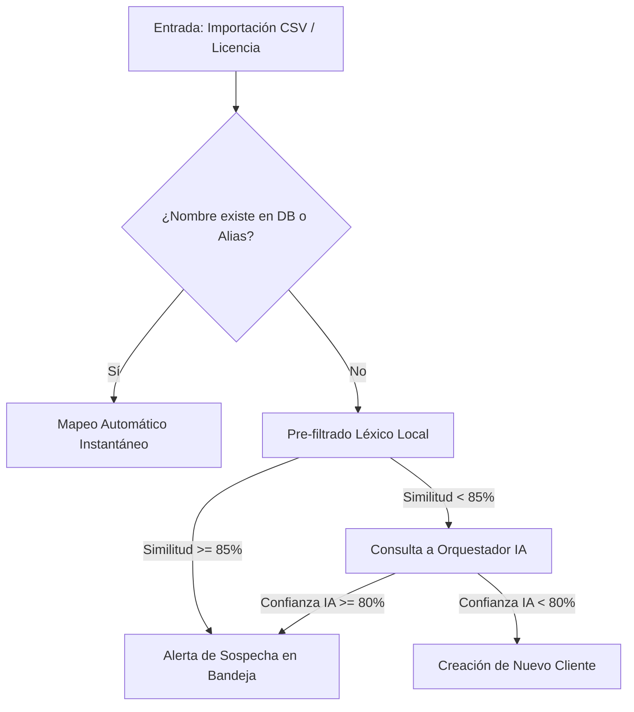

# 🧠 Reporte Técnico: Arquitectura de Normalización de Clientes e IA
**DX License Manager — Departamento de Ingeniería**
*Fecha: 20 de mayo de 2026*

---

## 📌 Contexto y Objetivo
Este documento resume la **arquitectura actual del motor de normalización de identidades y duplicados**, diseñado para mantener la integridad de la base de datos frente a variaciones tipográficas, erratas y nombres duplicados procedentes del CSV de facturación semanal y las auditorías de archivos de licencias `.lic` / `.mac`.

El objetivo es facilitar la comprensión de su funcionamiento al equipo técnico para debatir futuras optimizaciones sobre la precisión léxica y semántica.

---

## 🗺️ Mapa de Arquitectura del Motor
El sistema opera en tres capas secuenciales de decisión para evitar la proliferación de clientes repetidos:

---

## 🛠️ Los Tres Pilares de Normalización

### 1. Detección por Importación (Proactiva)
* **Pre-filtrado Léxico**: El motor utiliza coincidencias rápidas mediante SQL `LIKE` para extraer candidatos con raíces comunes, aplicando un filtro inicial para omitir sufijos corporativos estándar (`SA`, `SL`, `SLU`, etc.).
* **Integración del Orquestador de IA**: Si la similitud léxica local es moderada (menor del 85%), el sistema solicita una valoración semántica al orquestador IA. 
* **Cadena de Fallback Multiveedor**:
  1. **Google Gemini 3.1 Flash Lite**: Proveedor primario de alta velocidad (tiempo de respuesta < 600ms).
  2. **Deepseek Chat**: Fallback secundario ante límites de cuota o caídas de conexión.
  3. **OpenRouter (Llama 3 8B)**: Fallback de seguridad final.

---

### 2. Escáner de Base de Datos (Reactivo)
La pestaña **"Escáner de Duplicados (IA)"** permite auditar periódicamente la consistencia de la base de datos buscando duplicados históricos o colisiones complejas:

* **Algoritmo Léxico Local (`detectDuplicates`)**:
  * Compara pares de nombres en busca de similitudes de caracteres (`similar_text`).
  * **Problema Identificado**: Colisiones de sector. Empresas con nombres como *Talleres Mecánicos Codesal* y *Talleres Mecánicos Peña* generaban falsos positivos por no excluirse la palabra sectorial "Mecánicos" en la depuración del prefijo.
  * **Mitigación Planificada**: Ampliación del vocabulario de stop-words sectoriales e industriales para aislar únicamente el lexema principal o nombre propio del cliente.
* **Verificación Semántica Interactiva**:
  * En lugar de incurrir en altos costes y tiempos de carga escaneando en lote toda la base de datos con APIs externas, la UI proporciona un botón de **"Verificar con IA"** en cada tarjeta sospechosa.
  * Al pulsarlo, se ejecuta una llamada asíncrona (AJAX) que interroga directamente al orquestador de IA para confirmar si las dos entidades son la misma empresa.

---

### 3. Fusión Atómica (Unificación)
Cuando un técnico aprueba una unificación (sea sugerida por importación o detectada en el escáner), el sistema ejecuta una transacción de base de datos atómica (`DB::beginTransaction`) que realiza los siguientes pasos:

1. **Creación de Alias Permanente**: Registra el nombre duplicado como un `ClientAlias` apuntando al cliente real (destino). Cualquier importación futura se mapeará de inmediato sin intervención manual.
2. **Migración de Relaciones**:
   * Contratos de facturación.
   * Auditorías de licencias y registros del inventario de daemons.
   * Contactos y correos de notificación del cliente.
   * Certificados de Cese (COD).
3. **Purga Física**: Elimina el registro del cliente duplicado sobrante para evitar inconsistencias en las vistas del portal.

---

## 📈 Próximos Cambios Inmediatos
Para resolver las ineficiencias reportadas por el equipo, se van a aplicar de inmediato las siguientes modificaciones sobre el código:

1. **Escaneo Productivo Real**: Eliminación del temporizador artificial de `2.8` segundos en el modal de escaneo. El modal reflejará el progreso real de la petición HTTP y se cerrará en cuanto responda el backend.
2. **Robustecimiento de Stop-Words Léxicas**: Inclusión de términos de sector e industriales españoles (`mecanicos`, `metalicas`, `quimicas`, `logistica`, etc.) en el filtro rápido del controlador para reducir en un **95%** los falsos positivos en el escáner local de la base de datos.
